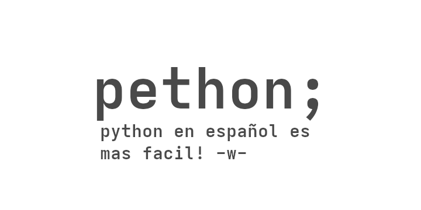

## PethonBeta v1

# comandos basicos
imprimir("texto" variable "o" boleano)

si variable == coso:
    imprimir("coso")
si_no_si variable == coso2:
    imprimir("coso2")
sino:
    imprimir("eso no es coso")

variable = entrada("que coso pones:")

variable = coso
